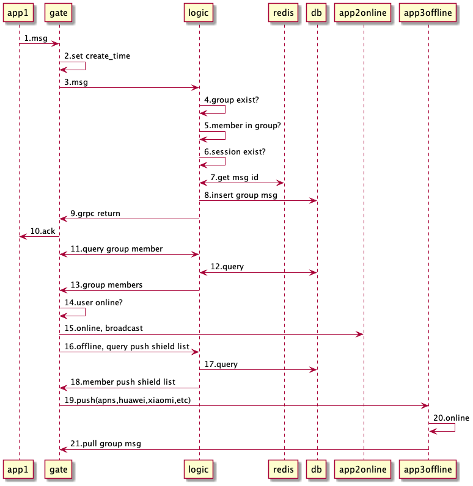
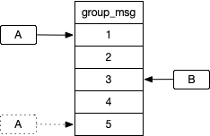
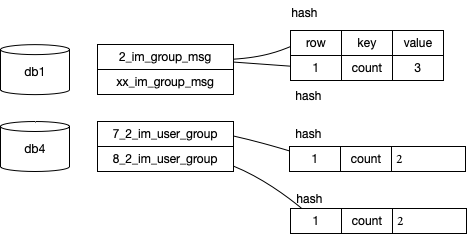

# IM群聊设计和实现

因为相对复杂一些，所以单独起一个文档记录和研究。

参考：
- [群消息已读回执（这个diao），究竟是推还是拉？](https://mp.weixin.qq.com/s/fQhmrrJ0jypm_O3WFs7ftw)
- [IM群聊消息如此复杂，如何保证不丢不重？](http://www.52im.net/thread-753-1-1.html)
- [IM单聊和群聊中的在线状态同步应该用“推”还是“拉”？](https://mp.weixin.qq.com/s?__biz=MjM5ODYxMDA5OQ==&mid=2651959618&idx=1&sn=912a9af6d000c6681dc645e53590729b&chksm=bd2d049e8a5a8d884f6acb35bc5b40edf88127219542c9e3033bb4c2e33854657c315c8a93b7&scene=21#wechat_redirect)
- [如何保证IM实时消息的“时序性”与“一致性”？](https://mp.weixin.qq.com/s?__biz=MjM5ODYxMDA5OQ==&mid=2651959666&idx=1&sn=fbdce26e40296d5b30f70915c4b9eb0a&chksm=bd2d04ae8a5a8db868df14904d0a1ddb4eb4d8411442f5529f9760e7c62fca586cfa6f3bd200&scene=21#wechat_redirect)
- [IM群聊消息究竟是存1份(即扩散读)还是存多份(即扩散写)？](https://mp.weixin.qq.com/s/1Pd0vhDu8lh9bpvKGQqLVA)

## 方案

### 群消息广播流程

  

1. app发送群消息到gate
2. gate收到后，以本地时间戳设置消息创建时间（客户端时间不可靠）
3. 转发
4. 向数据库查询群ID有效性，非法则直接忽略
5. 该成员是否在群成员内，非法则直接忽略
6. 用户和群的会话是否存在，不存在自动创建一条会话关系
7. 生成群内唯一消息ID
8. 写入数据库表group_msg中（按照gruopId%8分表）
9. 返回ack
10. 返回ack（如果有多端登录，广播msg到多个端，各个端再回复ack确认）
11. 向logic查询群成员列表
12. 查数据库
13. 接收群成员
14. 遍历
15. 在线的直接send
16. 离线的则推送，先去查询群推送标志设置。
17. 查数据库
18. 遍历所有离线成员的群推送标志列表
19. 未设置为免打扰的，直接推送。ios：apns，android：各种推送如华为、小米或者第三方如极光、信鸽等
20. 离线用户上线
21. 拉群消息（和微信不一样，这里的策略是：先查会话，点击群后拉最近20条消息展示，然后存储本地sqlite数据库。再往上滚，则继续拉。）

来自于TeamTalk这个方案，比较适合入门。采用了扩散读的方案（群消息只存储一份，拉取多次）

### 群未读计数实现方案

TeamTalk方案：群未读总数+每个用户一个key记录群已读消息数。  

某个用户群未读计数=total-offset

性能：
- 1个群200人，则产生201个key
- 1000个群，则1000*201个key=201 000（20万个），可以考虑把用户的合并成一个hash，减少key的数量。

可参考这篇文章：[TeamTalk源码分析——群聊技术方案和群未读计数的实现](https://blog.csdn.net/xmcy001122/article/details/109316394)

## 存储

### 扩散读方案

### 扩散写方案

## 进阶

### 时序性

### 不重复

### 不丢失

